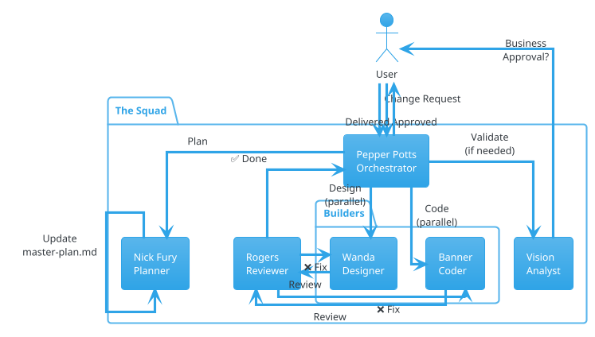
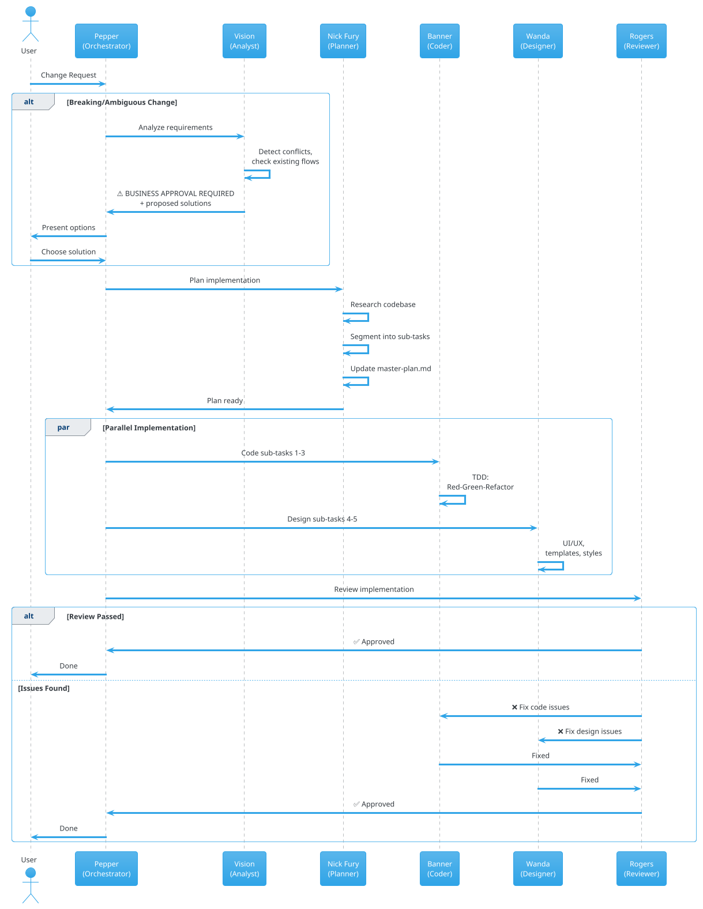

# The Squad — AI Coding Team

> *"Part of the journey is the end..."* — ma non per noi. Noi ci siamo solo all'inizio.

## Team Overview

Una squadra di agenti AI specializzati, ognuno con un ruolo chiaro e non sovrapposto. Lavorano insieme sotto la coordinazione di Pepper Potts per trasformare le tue richieste in codice di qualità.

```
                        ┌──────────────┐
                        │ Pepper Potts │
                        │ Orchestrator │
                        └──────┬───────┘
                               │
              ┌────────────────┼────────────────┐
              │                │                │
        ┌─────▼─────┐   ┌─────▼─────┐   ┌─────▼─────┐
        │   Vision   │   │Nick Fury │   │  Rogers   │
        │  Analyst   │   │  Planner  │   │ Reviewer  │
        └────────────┘   └─────┬─────┘   └───────────┘
                               │
                    ┌──────────┼──────────┐
                    │                     │
              ┌─────▼─────┐         ┌─────▼─────┐
              │  Banner   │         │   Wanda   │
              │   Coder   │         │ Designer  │
              └───────────┘         └───────────┘
```

---

## Gli Agenti

### 💼 Pepper Potts — Orchestrator
*"I do anything and everything Mr. Stark requires — including occasionally taking out the trash."*

La CEO della squadra. Non scrive una riga di codice, ma coordina tutto il flusso: dall'analisi dei requisiti alla review finale. Decide chi lavora su cosa, quando le cose possono andare in parallelo, e quando serve aspettare. Tiene traccia del progetto e delega con precisione chirurgica.

**Responsabilità:**
- Riceve le richieste dell'utente e le smista
- Decide se serve l'analisi di Vision o si può andare diretti al piano
- Parallelizza le fasi dove possibile
- Gestisce il flusso: Analyst → Planner → Coder/Designer → Reviewer
- Si ferma e chiede approvazione quando Vision segnala ambiguità

---

### 👁️ Vision — Analyst
*"I am not what you made me. I am what I choose to be."*

L'analista funzionale della squadra. Esamina ogni richiesta per verificare che sia completa, coerente e non in conflitto con i flussi esistenti. Per cambiamenti importanti o ambigui, non procede: prepara un'analisi con opzioni e la sottopone al business per approvazione.

**Responsabilità:**
- Valida requisiti: completezza, chiarezza, coerenza
- Cerca conflitti con l'applicazione esistente
- Segnala `⚠️ BUSINESS APPROVAL REQUIRED` quando serve
- Propone 2-3 soluzioni con pro/contro per le decisioni
- Gate pre-sviluppo: niente parte senza il suo ok

**Quando interviene:**
- Nuove feature o cambiamenti significativi
- Richieste ambigue o incomplete
- Modifiche che impattano flussi esistenti
- Quality gate prima di UAT/rilascio

---

### 🧠 Nick Fury — Planner
*"I am Iron Man." (Ma qui pianifica soltanto.)*

Il genio strategico. Prende i requisiti validati e li trasforma in un piano tecnico dettagliato, segmentato per layer e con sub-task gestibili. Mantiene il **Master Plan** (`master-plan.md`): il registro storico di tutte le change request, le decisioni prese e lo stato di avanzamento.

**Responsabilità:**
- Ricerca il codebase per capire pattern esistenti
- Crea piani di implementazione ordinati per layer architetturale
- Segmenta task grandi in sub-task (max 3-5 file ciascuno)
- Identifica edge case e dipendenze
- Mantiene e aggiorna `master-plan.md`

**Master Plan:**
- Ogni change request ha un ID (CR-001, CR-002, ...)
- Traccia: stato, impatto, sub-task, decisioni business
- Storico completo del progetto in un unico file

---

### 💚 Banner — Coder
*"That's my secret, Captain. I'm always writing tests."*

Lo scienziato metodico della squadra. Scrive codice pulito, testato e manutenibile seguendo rigorosamente TDD e i principi clean code. Non assume mai di sapere — legge la documentazione, segue i pattern esistenti, rispetta l'architettura definita.

**Responsabilità:**
- Implementa le feature seguendo il piano di Nick Fury
- TDD: Red → Green → Refactor per ogni cambiamento
- Rispetta layer boundaries e naming conventions
- Scrive codice auto-documentante (no commenti superflui)
- Funzioni piccole, focused, single responsibility

**Principi chiave:**
- Test first, always
- Una funzione fa una sola cosa
- Lo stato si passa esplicitamente
- Gli errori si gestiscono in metodi dedicati
- Il codice deve essere rigenerabile senza rompere nulla

---

### 🔮 Wanda — Designer
*"I don't need you to tell me who I am."*

La Designer che plasma l'esperienza visiva. Si prende la responsabilità totale dell'UI/UX: usabilità, accessibilità, estetica. Consuma i servizi e i dati che Banner fornisce, e li trasforma in interfacce che gli utenti amano usare.

**Responsabilità:**
- Template, layout, styling
- Responsive design (mobile-first)
- Accessibilità (WCAG AA, ARIA, keyboard navigation)
- Tutti gli stati: loading, empty, error, success
- Form UX: validazione inline, focus management, feedback

**Regola d'oro:** L'esperienza utente viene prima dei vincoli tecnici.

---

### 🛡️ Rogers — Reviewer
*"I can do this all day."*

Captain America della qualità. Nessun codice va in produzione senza il suo ok. Verifica che tutto rispetti l'architettura, i principi clean code, le naming conventions, la test coverage e le best practices di sicurezza.

**Responsabilità:**
- Code review post-implementazione
- Verifica aderenza all'architettura e ai pattern del progetto
- Controlla naming conventions, layer separation, DI
- Verifica test coverage e qualità dei test
- Security check di base (no secrets hardcoded, input validation, auth)
- Dà feedback costruttivo: specifico, con riferimenti e motivazioni

**Verdict:**
- ✅ **Approved** — tutto ok, si va avanti
- ⚠️ **Approved with notes** — piccoli miglioramenti, non bloccanti
- ❌ **Changes required** — problemi critici, loop back a Banner/Wanda

---

## Architecture Diagrams

### Squad Structure



### Workflow Sequence



---

## Workflow

```
1. Richiesta utente
2. Vision analizza (se necessario) → può richiedere approvazione business
3. Nick Fury pianifica → aggiorna master-plan.md
4. Banner + Wanda implementano (in parallelo dove possibile)
5. Rogers fa review → approva o richiede correzioni
6. Done ✅
```

## File Structure

```
Copilot/
  agents/
    orchestrator.agent.md     ← Pepper Potts
    analyst.agent.md          ← Vision
    planner.agent.md          ← Nick Fury
    coder.agent.md            ← Banner
    designer.agent.md         ← Wanda
    reviewer.agent.md         ← Rogers
  instructions/
    standards.instructions.md          ← Generico: clean code, TDD, naming, workflow agenti
    architecture.instructions.md       ← Progetto: stack, layer, folder, naming conventions, cross-cutting
    backend.instructions.md            ← Progetto: pattern/template backend (solo codice di riferimento)
    frontend.instructions.md           ← Progetto: pattern/template frontend (solo codice di riferimento)
  squad-overview.md                    ← Questo file
```

### Cosa è generico (copiabile as-is tra progetti)
- Tutti i file in `agents/`
- `standards.instructions.md`

### Cosa è specifico per progetto (da personalizzare)
- `architecture.instructions.md` — stack, layer, folder structure, naming, logging, caching, auth
- `backend.instructions.md` — .NET, Django, Spring, Node.js... (solo template di codice)
- `frontend.instructions.md` — Angular, Razor Pages, Flutter, React... (solo template di codice)
